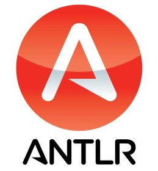

<div align='center'>



</div>

<p align="center">
    
    
</p>

<br>

This is the demo project for ANTLR4, using the C++ runtime.

The project files are the same as those available in the official ANTLR4 project, in its demo directory. And also compiling with the respective demo Lexer and Parser files.

The project is configured to be used on GNU/Linux operating systems.

Note: your parsing control file in C++ is at: <b>project/demo/Linux/main.cpp</b>

<br>

<b>Requirements:</b>
- Java installed, version used in tests: openjdk 11.0.13 2021-10-19
- Have the ANTLR4 Java package (it is already included inside the demo directory, file: antlr-4.9.2-complete.jar)
- Have CMAKE installed, version used: 3.16.3

<br>

<b>Instructions for compiling the project:</b>
- Give permissions to files:
```bash
chmod +x clean.sh
chmod +x clean-and-compile.sh
chmod +x re-compile.sh
```
- Run the <b>clean-and-compile.sh</b> file:
```bash
./clean-and-compile.sh
```

Após a compilação ser bem-sucedida será gerado o arquivo do binário em: <b>project/build/demo/antlr4-demo</b>.
No entando o script sempre copia o binário final para o diretório em questão, renomeando o mesmo para <b>parsing</b>.

<b>Descrição dos arquivos:</b>
- clean.sh - Limpa todos os arquivos temporários e arquivos de compilação.
- clean-and-compile.sh - Limpa todos os arquivos e reconstrói binários do projeto.
- re-compile.sh - Limpa arquivos temporários e reconstrói projeto sem necessitar recompilá-lo como um todo.
- project/ - diretório contendo todos os arquivos do projeto.
- project/demo/TLexer.g4 - Arquivo Lexer.
- project/demo/TParser.g4 - Arquivo Parser.
- project/demo/Linux/main.cpp - Arquivo C++ de controle do parser.

<b>Links e referências:</b>
- https://github.com/antlr/antlr4/blob/master/doc/cpp-target.md
- https://github.com/antlr/antlr4/blob/master/runtime/Cpp/demo/README.md
- https://github.com/antlr/antlr4/blob/master/runtime/Cpp/README.md

<br>

:smiley: Author
---

YouTube: [Melchisedech](https://www.youtube.com/channel/UC4Sh4wxncr5arnydpUfWPKw)<br>
Twitter: [Melchisedech333](https://twitter.com/Melchisedech333)<br>
Blog: [melchisedech333.github.io](https://melchisedech333.github.io/)<br>
LinkedIn: [Melchisedech Rex](https://www.linkedin.com/in/melchisedech-rex-724152235/)


<br>

:scroll: License
---

[ BSD-3-Clause license](./LICENSE.txt) © Verbum Paper


